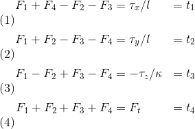
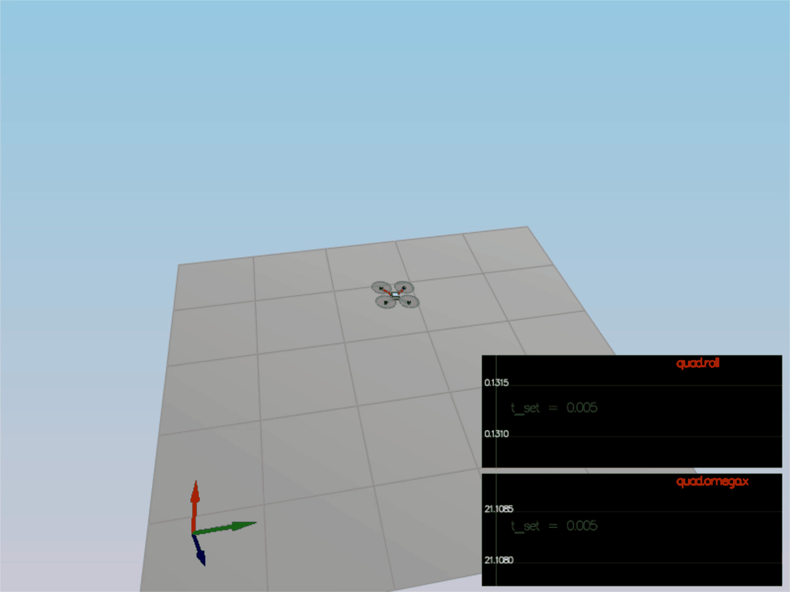
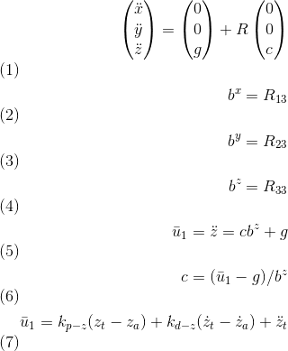

# FCND-Controls


The goal of this project is to implement and tune controller for drone in c++.
Udacity provides a [seed project](https://github.com/udacity/FCND-Controls-CPP) which has simulator implementation and source code.
To implement the controller we need to cover five scenarios. The simulator runs in a loop on the current scenario and its input shows scenario passed or not
There are two files in project that needs to be modified

- [/config/QuadControlParams.txt](./config/QuadControlParams.txt): This is the configuarion file  for the controller. While the simulator is running, file can be modified, and the simulator will "refresh" those parameters on the next loop execution.
- [/src/QuadControl.cpp](./src/QuadControl.cpp):  This file contains all the implementation of controller.

### Prerequisites

The IDE used for this project is Visual Studio  because I'm using Windows operating system Please, all instruction of using IDE were provided in udacity [seed project README.md](https://github.com/udacity/FCND-Controls-CPP).

### Run the code

To run a code need to open Simulator.sln in Visual Studio and retarget project to existing Windows SDK and then build the project

#### Scenario 1: Intro

In this scenario, we need to adjust the mass of the drone in [/config/QuadControlParams.txt](./cpp/config/QuadControlParams.txt) until it starts to hover a little:


When the scenario is passed, you should see this line on the standard output:

```
PASS: ABS(Quad.PosFollowErr) was less than 0.500000 for at least 0.800000 seconds
```

#### Scenario 2: Body rate and roll/pitch control

The [GenerateMotorCommands method](./src/QuadControl.cpp#L58-L93) needs to be coded resolving the following equations:



Where  `F_1` to `F_4` are the motor's thrust, `tao(x,y,z)` are the moments on each direction, `F_t` is the total thrust, kappa is the drag/thrust ratio and `l` is the drone arm length over square root of two. These equations are from the  lectures.

The second step is to implement the [BodyRateControl method](./src/QuadControl.cpp) applying a P controller and the moments of inertia. The `kpPQR` parameter were tuned to prevent the drone from flipping.

Next need to move to the [RollPitchControl method](./src/QuadControl.cpp). We need to apply a P controller to the elements `R13` and `R23` of the rotation matrix


We need to output roll and pitch rates; so, another equation is used:


Thrust needs to be inverted and converted to acceleration before applying the equations. After the implementation, start tuning `kpBank` and `kpPQR` until the drone behaves stable upward




When the scenario is passed the following will be the output:

```
PASS: ABS(Quad.Roll) was less than 0.025000 for at least 0.750000 seconds
PASS: ABS(Quad.Omega.X) was less than 2.500000 for at least 0.750000 seconds
```

#### Scenario 3: Position/velocity and yaw angle control

There are three methods needs to be implemented:

- [AltitudeControl](./src/QuadControl.cpp): This is a PD controller which controls the acceleration meaning the thrust needed to control the altitude.



- [LateralPositionControl](./src/QuadControl.cpp) This  PID controller controls acceleration on `x` and `y`.

- [YawControl](./src/QuadControl.cpp): This is P controller. The yaw optimized optimized  between `[-pi, pi]`.


When the scenario is passed the following will be the output:

```
PASS: ABS(Quad1.Pos.X) was less than 0.100000 for at least 1.250000 seconds
PASS: ABS(Quad2.Pos.X) was less than 0.100000 for at least 1.250000 seconds
PASS: ABS(Quad2.Yaw) was less than 0.100000 for at least 1.000000 seconds
```

#### Scenario 4: Non-idealities and robustness

W need to add an integral part to the altitude controller to move it from PD to PID controller.


When the scenario is passed the following will be the output:

```
PASS: ABS(Quad1.PosFollowErr) was less than 0.100000 for at least 1.500000 seconds
PASS: ABS(Quad2.PosFollowErr) was less than 0.100000 for at least 1.500000 seconds
PASS: ABS(Quad3.PosFollowErr) was less than 0.100000 for at least 1.500000 seconds
```

#### Scenario 5: Tracking trajectories

This is the final  scenario. The drone needs to follow a trajectory. 


When the scenario is passed the following will be the output:

```
PASS: ABS(Quad2.PosFollowErr) was less than 0.250000 for at least 3.000000 seconds
```

All steps were successfully implemented and all tests were passed
